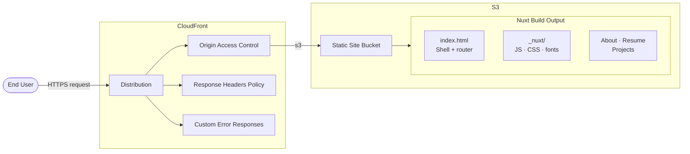

# AWS Architecture — Static Portfolio

## Resources

| Resource | Details |
|---|---|
| **CloudFront Distribution** | Global CDN; HTTPS-only, gzip, managed CachingOptimized policy |
| **Origin Access Control** | SigV4-signed requests — S3 bucket rejects all other access |
| **Security Headers Policy** | HSTS · X-Frame-Options · X-Content-Type-Options · Referrer-Policy · XSS-Protection |
| **Custom Error Responses** | 403/404 → `/index.html` (HTTP 200) so Nuxt's client-side router handles all paths |
| **S3 Bucket — Static Site** | Hosts built Nuxt output; fully private, versioning enabled |
